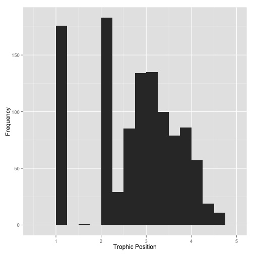
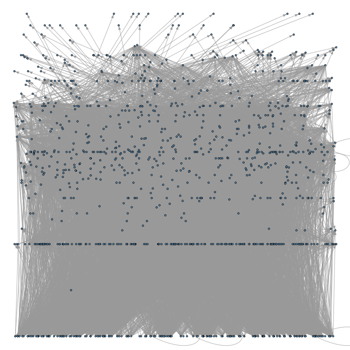
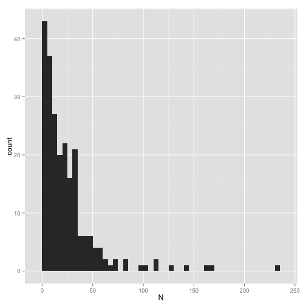

The Southern Ocean Food Web
========================================================


Load required libraries: 


```r
require(igraph)
require(NetIndices)
require(reshape2)
require(ggplot2)
require(devtools)
require(vegan)
```


Source code for functions to describe web properties


```r
url <- "https://raw.github.com/jjborrelli/Ecological-Networks/master/Food%20Webs/Rscripts/web_functions.R"
source_url(url)
```


Load in the data


```r
# s.ocean <- read.csv('http://esapubs.org/archive/ecol/E092/097/diet.csv')
s.ocean <- read.csv("~/Downloads/diet.csv")
```


Looking at all interactions


```r
el.df <- data.frame(pred = s.ocean$PREDATOR_NAME, prey = s.ocean$PREY_NAME)

SOgraph <- graph.edgelist(unique(as.matrix(el.df[, 1:2])))

SOadjacency <- get.adjacency(SOgraph, sparse = F)
```


Get whole web and node properties


```r
gind <- GenInd(SOadjacency)
diam <- diameter(SOgraph)
avpath <- average.path.length(SOgraph)
cluster <- transitivity(SOgraph)
loops <- sum(diag(SOadjacency))

degrees <- degree(SOgraph, mode = "all")
indegrees <- degree(SOgraph, mode = "in")
outdegrees <- degree(SOgraph, mode = "out")

numBas <- length(indegrees[which(indegrees == 0)])
numTop <- length(outdegrees[which(outdegrees == 0)])
basal <- (numBas/gind$N) * 100
top <- (numTop/gind$N) * 100
int <- ((gind$N - (numBas + numTop))/gind$N) * 100

web.props <- data.frame(N = gind$N, L = gind$Ltot, LD = gind$LD, C = gind$C, 
    D = diam, AvgPath = avpath, ClCoef = cluster, Loops = loops, Bas = basal, 
    Top = top, Int = int)
```


```
     N     L    LD        C D AvgPath ClCoef Loops  Bas   Top   Int
1 1095 10395 9.493 0.008677 6   2.114 0.1941    30 15.8 69.68 14.52
```


There are a total of 1095 species with 10395 interactions among them. The longest chain described in this food web is 6 but the average chain is 
2.1144.  


  
The short average path length in the food web is made clearer by looking at the distribution of trophic positions in the Southern Ocean Food Web.  


```r
qplot(tind$TL, binwidth = 0.25, geom = "histogram", xlab = "Trophic Position", 
    ylab = "Frequency")
```

 


There is a tall bar at trophic level 1 and 2 representing plants and herbivores. There is a single organism, _Chionodraco hamatus_, with a trophic level between 1 and 2, suggesting that it consumes both plant and animals (a true omnivore). I am unconvinced, however, that the dataset includes a fully sampled food web and that some of those organisms described as basal are not plants, but are crustaceans, or other small organisms.   

  
Most of the species in the food web are "top" predators with 70% of sampled species having no predators themselves. Plants ("basal species") make up 
16% of the web, and the remaining 15% are "intermediate". The disproportionately large proportion of "top" species is unusual compared to other empirically described food webs and may be the result of sampling methods. The connectance of the Southern Ocean Food Web is relatively low at 0.0087, but that is expected with such a large number of species.  


```r
par(mar = c(0, 0, 0, 0))
layouts <- matrix(c(runif(gind$N), tind$TL), ncol = 2)
plot.igraph(SOgraph, layout = layouts, vertex.label = NA, edge.arrow.size = 0.5, 
    vertex.size = 1)
```

 


By location


```r
m <- split(s.ocean, f = s.ocean$LOCATION)
location.g <- list()
for (i in 1:length(levels(s.ocean$LOCATION))) {
    
    el.df <- data.frame(pred = m[[i]]$PREDATOR_NAME, prey = m[[i]]$PREY_NAME)
    
    g <- graph.edgelist(unique(as.matrix(el.df[, 1:2])))
    
    location.g[[i]] <- g
}
```


Plot webs by location


```r
par(mfrow = c(114, 2), mar = c(0.01, 0.01, 0.01, 0.01))
for (i in 1:228) {
    plot.igraph(location.g[[i]], layout = layout.circle, edge.arrow.size = 0.5, 
        vertex.label = NA, vertex.size = 5)
    text(0, 0, label = i, cex = 2)
}
```

 


By year


```r
so.ode <- as.character(s.ocean$OBSERVATION_DATE_END)
so.ode.split <- strsplit(so.ode, split = "/")

year <- c()
for (i in 1:length(so.ode.split)) {
    year[i] <- so.ode.split[[i]][3]
}
s.ocean2 <- cbind(s.ocean, year)

m2 <- split(s.ocean2, f = s.ocean2$year)
year.g <- list()
for (i in 1:length(levels(s.ocean2$year))) {
    
    el.df <- data.frame(pred = m[[i]]$PREDATOR_NAME, prey = m[[i]]$PREY_NAME)
    
    g <- graph.edgelist(unique(as.matrix(el.df[, 1:2])))
    
    year.g[[i]] <- g
}
```


Plot webs by year

```r
par(mfrow = c(23, 2), mar = c(0.01, 0.01, 0.01, 0.01))
for (i in 1:45) {
    plot.igraph(year.g[[i]], layout = layout.circle, edge.arrow.size = 0.5, 
        vertex.label = NA, vertex.size = 5)
    text(0, 0, label = levels(s.ocean2$year)[i], cex = 2)
}
```

 

