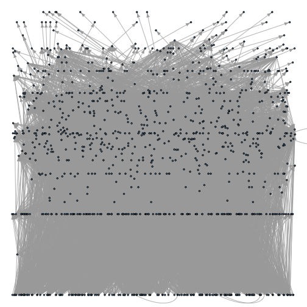
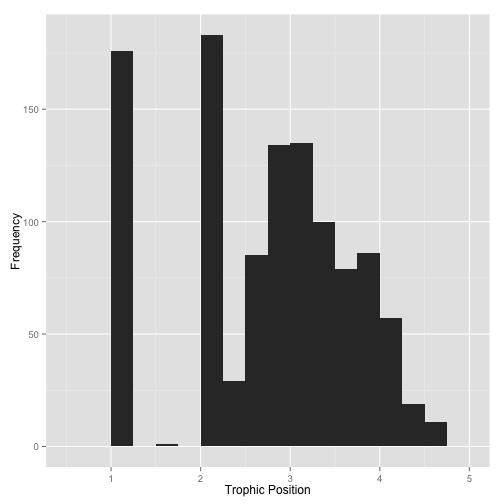
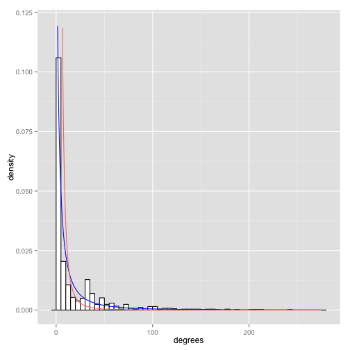
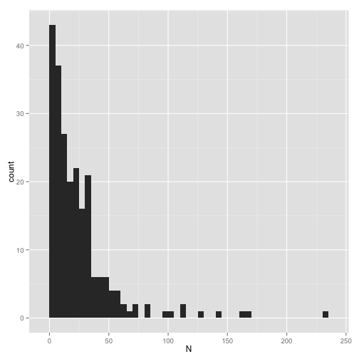
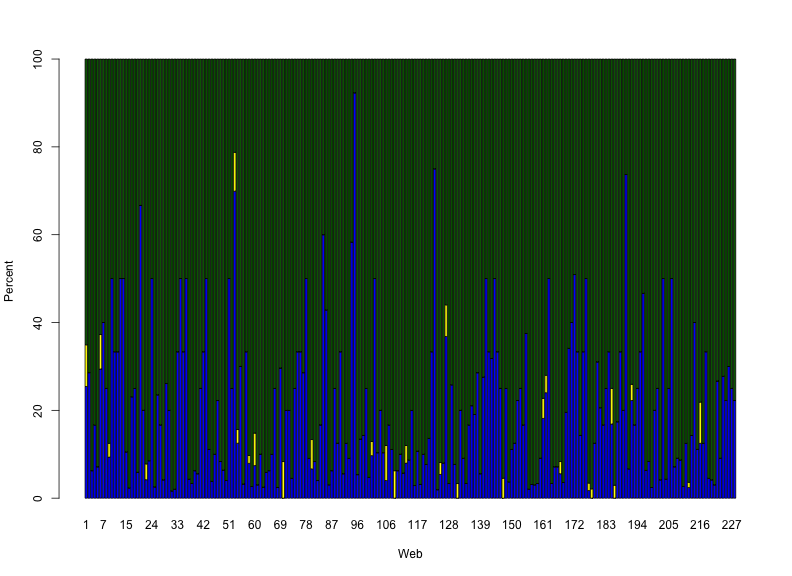
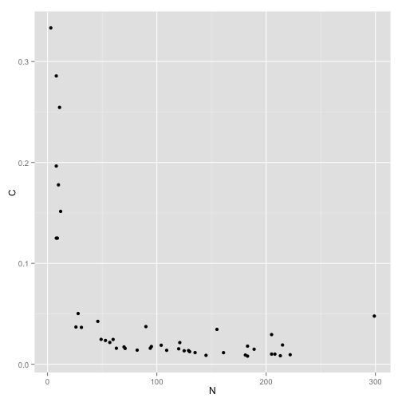

The Southern Ocean Food Web
========================================================


Load required libraries: 


```r
require(igraph)
require(NetIndices)
require(reshape2)
require(ggplot2)
require(devtools)
require(vegan)
```


Source code for functions to describe web properties


```r
url <- "https://raw.github.com/jjborrelli/Ecological-Networks/master/Food%20Webs/Rscripts/web_functions.R"
source_url(url)
```


Load in the data


```r
# s.ocean <- read.csv('http://esapubs.org/archive/ecol/E092/097/diet.csv')
s.ocean <- read.csv("~/Downloads/diet.csv")
```


## Whole Southern Ocean


```r
el.df <- data.frame(pred = s.ocean$PREDATOR_NAME, prey = s.ocean$PREY_NAME)

SOgraph <- graph.edgelist(unique(as.matrix(el.df[, 1:2])))

SOadjacency <- get.adjacency(SOgraph, sparse = F)
```


First take a quick look at what the food web looks like. Here I plot the web by trophic level by setting the layout (code shown below). Nodes are plotted with trophic position along the y-axis and plotted along the x-axis according to a random uniform distribution (`runif(x, 0, 1)`).  


```r
par(mar = c(0, 0, 0, 0))
layouts <- matrix(c(runif(gind$N), tind$TL), ncol = 2)
plot.igraph(SOgraph, layout = layouts, vertex.label = NA, edge.arrow.size = 0.5, 
    vertex.size = 1)
```

 


The plot of the web is not very helpful because there are so many species and far too many interactions. So looking at some of the whole web statistical properties and node properties may be more useful than just plotting the web.  

The `NetIndices` and `igraph` packages have functions to calculate a number of commonly used food web indices. The function `GenInd` from the `NetIndices` library easily calculates the number of nodes ($N$), total number of links ($L$), link density ($\frac{L}{N} = LD$), and connectance (along with some other indices that are not relevant to this dataset). Connectance in this case is calculated as: $$C = \frac{L}{N*(N-1)}$$  
  
The `diameter` is the single longest path between two nodes. The `average.path.length` is the mean number of links between any two nodes in the web. The clustering coefficient (or `transitivity`) is the probability that the nearest neighbors of a given vertex are themselves connected. A high clustering coefficient is an indication that a network has "small world" properties. The sum of the diagonal elements of the adjacency matrix gives the number of species that are cannibalistic, with links that loop back to themselves.   
  
Species in a food web may be either basal, intermediate, or top. These positions may be determined simply by examining the degree of each node. The number of links pointing towards a node is its in-degree and the number of links pointing away from a node is the out-degree. In-degree is therefore a measure of how many species the node of interest preys upon (generality) while out-degree is the number of predators a given node has (vulnerability). Basal nodes will have an in-degree of 0, and likewise top species will have an out-degree of 0. Once the number of basal and top species are found, the number of intermediate species is simply the remainder. 


```r
gind <- GenInd(SOadjacency)
diam <- diameter(SOgraph)
avpath <- average.path.length(SOgraph)
cluster <- transitivity(SOgraph)
cannibals <- sum(diag(SOadjacency))

degrees <- degree(SOgraph, mode = "all")
indegrees <- degree(SOgraph, mode = "in")
outdegrees <- degree(SOgraph, mode = "out")

numBas <- length(indegrees[which(indegrees == 0)])
numTop <- length(outdegrees[which(outdegrees == 0)])
basal <- (numBas/gind$N) * 100
top <- (numTop/gind$N) * 100
int <- ((gind$N - (numBas + numTop))/gind$N) * 100

web.props <- data.frame(N = gind$N, L = gind$Ltot, LD = gind$LD, C = gind$C, 
    D = diam, AvgPath = avpath, ClCoef = cluster, Can = cannibals, Bas = basal, 
    Top = top, Int = int)
```


```
     N     L    LD        C D AvgPath ClCoef Can  Bas   Top   Int
1 1095 10395 9.493 0.008677 6   2.114 0.1941  30 15.8 69.68 14.52
```


There are a total of 1095 species with 10395 interactions among them. The longest chain described in this food web is 6 but the average chain is 
2.1144.  


  
The short average path length in the food web is made clearer by looking at the distribution of trophic positions in the Southern Ocean Food Web.  


```r
qplot(tind$TL, binwidth = 0.25, geom = "histogram", xlab = "Trophic Position", 
    ylab = "Frequency")
```

 


There is a tall bar at trophic level 1 and 2 representing plants and herbivores. There is a single organism, _Chionodraco hamatus_, with a trophic level between 1 and 2, suggesting that it consumes both plant and animals (a true omnivore). I am unconvinced, however, that the dataset includes a fully sampled food web and that some of those organisms described as basal are not plants, but are crustaceans, or other small organisms.   

  
Most of the species in the food web are "top" predators with 70% of sampled species having no predators themselves. Plants ("basal species") make up 
16% of the web, and the remaining 15% are "intermediate". The disproportionately large proportion of "top" species is unusual compared to other empirically described food webs and may be the result of sampling methods. The connectance of the Southern Ocean Food Web is relatively low at 0.0087, but that is expected with such a large number of species.  

The degree distribution of a food web is often described as being power-law distributed, with most nodes having few links, and few nodes having many links. The degree distribution may be plotted as a histogram. Rather than fitting a power law to the distribution I have fit a lognormal distribution to the data, as it appears to be the better fit. In the following plot I have included a line fit to a lognormal (blue) and power law (green) distributions. The lognormal distribution appears to be a better fit to the degree distribution.  
  


```r
degdisfit <- fitdistr(degrees, "lognormal")
degdispow <- power.law.fit(degrees, force.continuous = T)

dd <- ggplot(data.frame(degrees = degrees), aes(x = degrees))
dd <- dd + geom_histogram(aes(y = ..density..), binwidth = 5, colour = "black", 
    fill = "white")

sequ <- seq(1, 300, 0.25)

dd <- dd + geom_line(aes(x = sequ[1:1095], y = dlnorm(sequ[1:1095], degdisfit[[1]][1], 
    degdisfit[[1]][2])), colour = "blue")
dd <- dd + geom_line(aes(x = sequ[1:1095], y = 20 * sequ[1:1095]^-degdispow$alpha, 
    colour = "green"))
dd + scale_y_continuous(limits = c(0, 0.12)) + theme(legend.position = "none")
```

 


```r
# motif_counter(list(SOgraph), webs = 'Southern Ocean') pSO <-
# permatfull(SOadjacency, fixedmar = 'row', mtype = 'prab', times = 100)

```


-----------------------------------------------------------  

## By location

The following code splits up the dataframe by the location column. The resulting 228 graph objects get stored in `location.g`. _NOTE: the first location is a blank (`" "`) indicating that there are some rows without a location_  


```r
places <- read.csv("~/Desktop/locationLEVELS.csv")
placesC <- c()
for (i in 1:228) {
    placesC[i] <- as.character(places[[1]][i])
}

m <- split(s.ocean, f = s.ocean$LOCATION)
location.g <- list()
for (i in 1:length(levels(s.ocean$LOCATION))) {
    
    el.df <- data.frame(pred = m[[i]]$PREDATOR_NAME, prey = m[[i]]$PREY_NAME)
    
    g <- graph.edgelist(unique(as.matrix(el.df[, 1:2])))
    
    location.g[[i]] <- g
    
}
```


Plotting webs by location provides some idea about what trophic information was obtained from different sampling locations in the Southern Ocean.


```r
par(mfrow = c(114, 2), mar = c(0.01, 0.01, 0.01, 0.01))
for (i in 1:228) {
    plot.igraph(location.g[[i]], layout = layout.circle, edge.arrow.size = 0.5, 
        vertex.label = NA, vertex.size = 5)
    text(0, 0, label = placesC[i], cex = 1.5)
}
```

```
Warning: conversion failure on 'Terre Adü¾™£ ¼le ' in 'mbcsToSbcs': dot
substituted for <8f> Warning: font metrics unknown for character 0x8f
```

 


It is readily apparent from the food web plots that some sampling locations
(e.g., **Bay of Morbihan. Kerguelen Islands**; **Iles Crozets**; **Seal Island**; etc.) included only a single predator with a portion of its prey. Others, like **Amanda Bay** and **Rampen**, included a single prey with some of its predators. A few locations, however, have enough species and interactions to be conisdered a near complete food web themselves (e.g., **Croker Passage**; **Scotia Sea. Weddell Sea**). Most webs have a small number of predators and prey and a few interactions. It is also worth noting that there appears to be several repeat locations in the data, such as **Kerguelen Island, Kerguelen Island1, Kerguelen Islands, Kerguelen Islands1, Kerguelen waters**. It may be best to merge webs with locations that are approximately the same. This might reduce the number of webs with only a handful of species.    
  
Like the whole food web properties calculated above, indices can be calculated for each of the location subwebs.  


```r
web.props1 <- data.frame()
for (i in 1:228) {
    gind <- GenInd(get.adjacency(location.g[[i]], sparse = F))
    diam <- diameter(location.g[[i]])
    avpath <- average.path.length(location.g[[i]])
    cluster <- transitivity(location.g[[i]])
    cannibals <- sum(diag(get.adjacency(location.g[[i]], sparse = F)))
    
    degrees <- degree(location.g[[i]], mode = "all")
    indegrees <- degree(location.g[[i]], mode = "in")
    outdegrees <- degree(location.g[[i]], mode = "out")
    
    numBas <- length(indegrees[which(indegrees == 0)])
    numTop <- length(outdegrees[which(outdegrees == 0)])
    basal <- (numBas/gind$N) * 100
    top <- (numTop/gind$N) * 100
    int <- ((gind$N - (numBas + numTop))/gind$N) * 100
    
    web.props <- data.frame(N = gind$N, L = gind$Ltot, LD = gind$LD, C = gind$C, 
        D = diam, AvgPath = avpath, ClCoef = cluster, Can = cannibals, Bas = basal, 
        Top = top, Int = int)
    web.props1 <- rbind(web.props1, web.props)
}

print(web.props1)
```

```
      N    L      LD       C D AvgPath   ClCoef Can    Bas    Top   Int
1   232 2158  9.3017 0.04027 4   1.261 0.020466   1 25.431 65.086 9.483
2    14   27  1.9286 0.14835 1   1.000 0.000000   0 28.571 71.429 0.000
3    16   15  0.9375 0.06250 1   1.000 0.000000   0  6.250 93.750 0.000
4     6    5  0.8333 0.16667 1   1.000 0.000000   0 16.667 83.333 0.000
5    14   13  0.9286 0.07143 1   1.000 0.000000   0  7.143 92.857 0.000
6    51   98  1.9216 0.03843 3   1.203 0.060484   2 29.412 62.745 7.843
7     5    4  0.8000 0.20000 1   1.000 0.000000   0 40.000 60.000 0.000
8     4    3  0.7500 0.25000 1   1.000 0.000000   0 25.000 75.000 0.000
9    32   33  1.0312 0.03327 2   1.057 0.000000   0  9.375 87.500 3.125
10    2    1  0.5000 0.50000 1   1.000      NaN   0 50.000 50.000 0.000
11   15   38  2.5333 0.18095 1   1.000 0.000000   0 33.333 66.667 0.000
12    3    2  0.6667 0.33333 1   1.000 0.000000   0 33.333 66.667 0.000
13    2    1  0.5000 0.50000 1   1.000      NaN   0 50.000 50.000 0.000
14    2    1  0.5000 0.50000 1   1.000      NaN   0 50.000 50.000 0.000
15   19   27  1.4211 0.07895 1   1.000 0.000000   0 10.526 89.474 0.000
16   43   42  0.9767 0.02326 1   1.000 0.000000   0  2.326 97.674 0.000
17   13   15  1.1538 0.09615 1   1.000 0.000000   0 23.077 76.923 0.000
18    4    3  0.7500 0.25000 1   1.000 0.000000   0 25.000 75.000 0.000
19   17   16  0.9412 0.05882 1   1.000 0.000000   0  5.882 94.118 0.000
20    3    2  0.6667 0.33333 1   1.000 0.000000   0 66.667 33.333 0.000
21    5    4  0.8000 0.20000 1   1.000 0.000000   0 20.000 80.000 0.000
22  167  337  2.0180 0.01216 2   1.259 0.003253   0  4.192 92.216 3.593
23  141  274  1.9433 0.01388 1   1.000 0.000000   0  8.511 91.489 0.000
24    2    1  0.5000 0.50000 1   1.000      NaN   0 50.000 50.000 0.000
25   39   38  0.9744 0.02564 1   1.000 0.000000   0  2.564 97.436 0.000
26   17   22  1.2941 0.08088 1   1.000 0.000000   0 23.529 76.471 0.000
27    6    5  0.8333 0.16667 1   1.000 0.000000   0 16.667 83.333 0.000
28   24   23  0.9583 0.04167 1   1.000 0.000000   0  4.167 95.833 0.000
29   23   43  1.8696 0.08498 1   1.000 0.000000   0 26.087 73.913 0.000
30    5    4  0.8000 0.20000 1   1.000 0.000000   0 20.000 80.000 0.000
31   61   60  0.9836 0.01639 1   1.000 0.000000   0  1.639 98.361 0.000
32   49   48  0.9796 0.02041 1   1.000 0.000000   0  2.041 97.959 0.000
33    3    2  0.6667 0.33333 1   1.000 0.000000   0 33.333 66.667 0.000
34    2    1  0.5000 0.50000 1   1.000      NaN   0 50.000 50.000 0.000
35    3    2  0.6667 0.33333 1   1.000 0.000000   0 33.333 66.667 0.000
36    2    1  0.5000 0.50000 1   1.000      NaN   0 50.000 50.000 0.000
37   23   22  0.9565 0.04348 1   1.000 0.000000   0  4.348 95.652 0.000
38   30   29  0.9667 0.03333 1   1.000 0.000000   0  3.333 96.667 0.000
39   16   15  0.9375 0.06250 1   1.000 0.000000   0  6.250 93.750 0.000
40   18   17  0.9444 0.05556 1   1.000 0.000000   0  5.556 94.444 0.000
41    4    3  0.7500 0.25000 1   1.000 0.000000   0 25.000 75.000 0.000
42    3    2  0.6667 0.33333 1   1.000 0.000000   0 33.333 66.667 0.000
43    2    1  0.5000 0.50000 1   1.000      NaN   0 50.000 50.000 0.000
44   27   36  1.3333 0.05128 1   1.000 0.000000   0 11.111 88.889 0.000
45   26   25  0.9615 0.03846 1   1.000 0.000000   0  3.846 96.154 0.000
46   10    9  0.9000 0.10000 1   1.000 0.000000   0 10.000 90.000 0.000
47    9   14  1.5556 0.19444 1   1.000 0.000000   0 22.222 77.778 0.000
48   24   23  0.9583 0.04167 1   1.000 0.000000   0  8.333 91.667 0.000
49   47   69  1.4681 0.03191 1   1.000 0.000000   0  6.383 93.617 0.000
50   25   24  0.9600 0.04000 1   1.000 0.000000   0  4.000 96.000 0.000
51    2    1  0.5000 0.50000 1   1.000      NaN   0 50.000 50.000 0.000
52    4    3  0.7500 0.25000 1   1.000 0.000000   0 25.000 75.000 0.000
53  113 2852 25.2389 0.22535 2   1.058 0.356413  10 69.912 21.239 8.850
54   32   50  1.5625 0.05040 1   1.000 0.000000   1 12.500 84.375 3.125
55   10   13  1.3000 0.14444 1   1.000 0.000000   0 30.000 70.000 0.000
56   31   30  0.9677 0.03226 1   1.000 0.000000   0  3.226 96.774 0.000
57    3    2  0.6667 0.33333 1   1.000 0.000000   0 33.333 66.667 0.000
58  113  225  1.9912 0.01778 2   1.277 0.006606   0  7.965 90.265 1.770
59   38   37  0.9737 0.02632 1   1.000 0.000000   0  2.632 97.368 0.000
60   27   52  1.9259 0.07407 2   1.136 0.025140   1  7.407 85.185 7.407
61   33   32  0.9697 0.03030 1   1.000 0.000000   0  3.030 96.970 0.000
62   10    9  0.9000 0.10000 1   1.000 0.000000   0 10.000 90.000 0.000
63   40   39  0.9750 0.02500 1   1.000 0.000000   0  2.500 97.500 0.000
64   17   16  0.9412 0.05882 1   1.000 0.000000   0  5.882 94.118 0.000
65   16   15  0.9375 0.06250 1   1.000 0.000000   0  6.250 93.750 0.000
66   10    9  0.9000 0.10000 1   1.000 0.000000   0 10.000 90.000 0.000
67   28   45  1.6071 0.05952 1   1.000 0.000000   0 25.000 75.000 0.000
68   41   40  0.9756 0.02439 1   1.000 0.000000   0  2.439 97.561 0.000
69   27   43  1.5926 0.06125 1   1.000 0.000000   0 29.630 70.370 0.000
70   24   33  1.3750 0.05978 2   1.158 0.101887   1  0.000 91.667 8.333
71    5    4  0.8000 0.20000 1   1.000 0.000000   0 20.000 80.000 0.000
72    5    4  0.8000 0.20000 1   1.000 0.000000   0 20.000 80.000 0.000
73   22   21  0.9545 0.04545 1   1.000 0.000000   0  4.545 95.455 0.000
74    4    3  0.7500 0.25000 1   1.000 0.000000   0 25.000 75.000 0.000
75    3    2  0.6667 0.33333 1   1.000 0.000000   0 33.333 66.667 0.000
76    3    2  0.6667 0.33333 1   1.000 0.000000   0 33.333 66.667 0.000
77    7   10  1.4286 0.23810 1   1.000 0.000000   0 28.571 71.429 0.000
78    2    1  0.5000 0.50000 1   1.000      NaN   0 50.000 50.000 0.000
79   22   23  1.0455 0.04978 1   1.000 0.000000   0  9.091 90.909 0.000
80   15   16  1.0667 0.07619 2   1.158 0.083333   0  6.667 86.667 6.667
81   84  151  1.7976 0.02166 1   1.000 0.000000   0  8.333 91.667 0.000
82   25   24  0.9600 0.04000 1   1.000 0.000000   0  4.000 96.000 0.000
83   12   12  1.0000 0.09091 1   1.000 0.000000   0 16.667 83.333 0.000
84    5    3  0.6000 0.15000 1   1.000 0.000000   0 60.000 40.000 0.000
85    7   11  1.5714 0.26190 1   1.000 0.000000   0 42.857 57.143 0.000
86   33   32  0.9697 0.03030 1   1.000 0.000000   0  3.030 96.970 0.000
87   16   15  0.9375 0.06250 1   1.000 0.000000   0  6.250 93.750 0.000
88    4    3  0.7500 0.25000 1   1.000 0.000000   0 25.000 75.000 0.000
89    8    7  0.8750 0.12500 1   1.000 0.000000   0 12.500 87.500 0.000
90    6    6  1.0000 0.20000 1   1.000 0.000000   0 33.333 66.667 0.000
91   72   77  1.0694 0.01506 1   1.000 0.000000   0  5.556 94.444 0.000
92    8    7  0.8750 0.12500 1   1.000 0.000000   0 12.500 87.500 0.000
93   22   21  0.9545 0.04545 1   1.000 0.000000   0  9.091 90.909 0.000
94   12   28  2.3333 0.21212 1   1.000 0.000000   0 58.333 41.667 0.000
95   13   12  0.9231 0.07692 1   1.000 0.000000   0 92.308  7.692 0.000
96   56   96  1.7143 0.03117 1   1.000 0.000000   0  5.357 94.643 0.000
97   67  115  1.7164 0.02601 1   1.000 0.000000   0 13.433 86.567 0.000
98    7    6  0.8571 0.14286 1   1.000 0.000000   0 14.286 85.714 0.000
99    4    3  0.7500 0.25000 1   1.000 0.000000   0 25.000 75.000 0.000
100  42   42  1.0000 0.02439 1   1.000 0.000000   0  4.762 95.238 0.000
101  31   54  1.7419 0.05806 2   1.054 0.034722   1  9.677 87.097 3.226
102   4    2  0.5000 0.16667 1   1.000      NaN   0 50.000 50.000 0.000
103  29   27  0.9310 0.03325 1   1.000 0.000000   0 10.345 89.655 0.000
104   5    4  0.8000 0.20000 1   1.000 0.000000   0 20.000 80.000 0.000
105  29   38  1.3103 0.04680 1   1.000 0.000000   0 10.345 89.655 0.000
106  50  165  3.3000 0.06735 2   1.125 0.306778   4  4.000 88.000 8.000
107   6    5  0.8333 0.16667 1   1.000 0.000000   0 16.667 83.333 0.000
108   9    8  0.8889 0.11111 1   1.000 0.000000   0 11.111 88.889 0.000
109  32   33  1.0312 0.03327 2   1.418 0.009119   1  0.000 93.750 6.250
110  48   67  1.3958 0.02970 1   1.000 0.000000   0  6.250 93.750 0.000
111  10    9  0.9000 0.10000 1   1.000 0.000000   0 10.000 90.000 0.000
112  35   37  1.0571 0.03109 1   1.000 0.000000   0  5.714 94.286 0.000
113  50   59  1.1800 0.02408 2   1.033 0.005515   1  8.000 88.000 4.000
114  23   42  1.8261 0.08300 1   1.000 0.000000   0  8.696 91.304 0.000
115  10   16  1.6000 0.17778 1   1.000 0.000000   0 20.000 80.000 0.000
116  35   34  0.9714 0.02857 1   1.000 0.000000   0  2.857 97.143 0.000
117 103  205  1.9903 0.01951 1   1.000 0.000000   0 10.680 89.320 0.000
118  32   31  0.9688 0.03125 1   1.000 0.000000   0  3.125 96.875 0.000
119  10    9  0.9000 0.10000 1   1.000 0.000000   0 10.000 90.000 0.000
120  13   12  0.9231 0.07692 1   1.000 0.000000   0  7.692 92.308 0.000
121  22   28  1.2727 0.06061 1   1.000 0.000000   0 13.636 86.364 0.000
122   3    2  0.6667 0.33333 1   1.000 0.000000   0 33.333 66.667 0.000
123  12   16  1.3333 0.12121 1   1.000 0.000000   0 75.000 25.000 0.000
124  52   51  0.9808 0.01923 1   1.000 0.000000   0  1.923 98.077 0.000
125  37   40  1.0811 0.03003 2   1.375 0.007874   0  5.405 91.892 2.703
126  25   46  1.8400 0.07667 1   1.000 0.000000   0  8.000 92.000 0.000
127 125  967  7.7360 0.06239 3   1.074 0.311741   4 36.800 56.000 7.200
128  30   29  0.9667 0.03333 1   1.000 0.000000   0  3.333 96.667 0.000
129  31   67  2.1613 0.07204 1   1.000 0.000000   0 25.806 74.194 0.000
130  13   12  0.9231 0.07692 1   1.000 0.000000   0  7.692 92.308 0.000
131  30   30  1.0000 0.03448 1   1.000 0.000000   1  0.000 96.667 3.333
132   5    4  0.8000 0.20000 1   1.000 0.000000   0 20.000 80.000 0.000
133  11   10  0.9091 0.09091 1   1.000 0.000000   0  9.091 90.909 0.000
134  30   29  0.9667 0.03333 1   1.000 0.000000   0  3.333 96.667 0.000
135   6    5  0.8333 0.16667 1   1.000 0.000000   0 16.667 83.333 0.000
136  19   27  1.4211 0.07895 1   1.000 0.000000   0 21.053 78.947 0.000
137  21   27  1.2857 0.06429 1   1.000 0.000000   0 19.048 80.952 0.000
138   7    6  0.8571 0.14286 1   1.000 0.000000   0 28.571 71.429 0.000
139  18   17  0.9444 0.05556 1   1.000 0.000000   0  5.556 94.444 0.000
140  29   49  1.6897 0.06034 1   1.000 0.000000   0 27.586 72.414 0.000
141   4    3  0.7500 0.25000 1   1.000 0.000000   0 50.000 50.000 0.000
142   6    8  1.3333 0.26667 1   1.000 0.000000   0 33.333 66.667 0.000
143  22   51  2.3182 0.11039 1   1.000 0.000000   0 31.818 68.182 0.000
144   2    1  0.5000 0.50000 1   1.000      NaN   0 50.000 50.000 0.000
145   3    2  0.6667 0.33333 1   1.000 0.000000   0 33.333 66.667 0.000
146   4    3  0.7500 0.25000 1   1.000 0.000000   0 25.000 75.000 0.000
147  22   22  1.0000 0.04762 1   1.000 0.000000   1  0.000 95.455 4.545
148   4    3  0.7500 0.25000 1   1.000 0.000000   0 25.000 75.000 0.000
149  27   26  0.9630 0.03704 1   1.000 0.000000   0  3.704 96.296 0.000
150   9    8  0.8889 0.11111 1   1.000 0.000000   0 11.111 88.889 0.000
151   8    7  0.8750 0.12500 1   1.000 0.000000   0 12.500 87.500 0.000
152   9    8  0.8889 0.11111 1   1.000 0.000000   0 22.222 77.778 0.000
153   4    3  0.7500 0.25000 1   1.000 0.000000   0 25.000 75.000 0.000
154   6    5  0.8333 0.16667 1   1.000 0.000000   0 16.667 83.333 0.000
155   8   12  1.5000 0.21429 1   1.000 0.000000   0 37.500 62.500 0.000
156  48   47  0.9792 0.02083 1   1.000 0.000000   0  2.083 97.917 0.000
157  32   31  0.9688 0.03125 1   1.000 0.000000   0  3.125 96.875 0.000
158  33   32  0.9697 0.03030 1   1.000 0.000000   0  3.030 96.970 0.000
159  30   29  0.9667 0.03333 1   1.000 0.000000   0  3.333 96.667 0.000
160  11   10  0.9091 0.09091 1   1.000 0.000000   0  9.091 90.909 0.000
161  22   21  0.9545 0.04545 2   1.764 0.000000   0 18.182 77.273 4.545
162  25   34  1.3600 0.05667 2   1.029 0.061644   0 24.000 72.000 4.000
163   2    1  0.5000 0.50000 1   1.000      NaN   0 50.000 50.000 0.000
164  30   29  0.9667 0.03333 1   1.000 0.000000   0  3.333 96.667 0.000
165  14   13  0.9286 0.07143 1   1.000 0.000000   0  7.143 92.857 0.000
166  14   13  0.9286 0.07143 1   1.000 0.000000   0  7.143 92.857 0.000
167  72   75  1.0417 0.01467 2   1.051 0.000000   1  5.556 91.667 2.778
168  56   62  1.1071 0.02013 1   1.000 0.000000   0  3.571 96.429 0.000
169  46  201  4.3696 0.09710 1   1.000 0.000000   0 19.565 80.435 0.000
170  41  378  9.2195 0.23049 1   1.000 0.000000   0 34.146 65.854 0.000
171   5    5  1.0000 0.25000 1   1.000 0.000000   0 40.000 60.000 0.000
172  55  756 13.7455 0.25455 1   1.000 0.000000   0 50.909 49.091 0.000
173  24   52  2.1667 0.09420 1   1.000 0.000000   0 33.333 66.667 0.000
174   7    6  0.8571 0.14286 1   1.000 0.000000   0 14.286 85.714 0.000
175   3    2  0.6667 0.33333 1   1.000 0.000000   0 33.333 66.667 0.000
176   2    1  0.5000 0.50000 1   1.000      NaN   0 50.000 50.000 0.000
177  58   65  1.1207 0.01966 2   1.030 0.013663   1  1.724 96.552 1.724
178  95  114  1.2000 0.01277 2   1.333 0.015446   2  0.000 97.895 2.105
179  16   20  1.2500 0.08333 1   1.000 0.000000   0 12.500 87.500 0.000
180  29   50  1.7241 0.06158 1   1.000 0.000000   0 31.034 68.966 0.000
181  34   73  2.1471 0.06506 1   1.000 0.000000   0 20.588 79.412 0.000
182  12   20  1.6667 0.15152 1   1.000 0.000000   0 16.667 83.333 0.000
183   8    9  1.1250 0.16071 1   1.000 0.000000   0 25.000 75.000 0.000
184   6    4  0.6667 0.13333 1   1.000 0.000000   0 33.333 66.667 0.000
185 160  527  3.2938 0.02072 2   1.165 0.069385   2 16.875 75.000 8.125
186  34   34  1.0000 0.03030 1   1.000 0.000000   1  0.000 97.059 2.941
187  46   67  1.4565 0.03237 1   1.000 0.000000   0 17.391 82.609 0.000
188   3    2  0.6667 0.33333 1   1.000 0.000000   0 33.333 66.667 0.000
189  10   12  1.2000 0.13333 1   1.000 0.000000   0 20.000 80.000 0.000
190  19   51  2.6842 0.14912 1   1.000 0.000000   0 73.684 26.316 0.000
191  15   14  0.9333 0.06667 1   1.000 0.000000   0  6.667 93.333 0.000
192  27   46  1.7037 0.06553 2   1.098 0.000000   0 22.222 74.074 3.704
193  24   35  1.4583 0.06341 1   1.000 0.000000   0 16.667 83.333 0.000
194   4    3  0.7500 0.25000 1   1.000 0.000000   0 25.000 75.000 0.000
195   3    2  0.6667 0.33333 1   1.000 0.000000   0 33.333 66.667 0.000
196  15   17  1.1333 0.08095 1   1.000 0.000000   0 46.667 53.333 0.000
197  63   84  1.3333 0.02151 1   1.000 0.000000   0  6.349 93.651 0.000
198  12   11  0.9167 0.08333 1   1.000 0.000000   0  8.333 91.667 0.000
199  41   40  0.9756 0.02439 1   1.000 0.000000   0  2.439 97.561 0.000
200   5    4  0.8000 0.20000 1   1.000 0.000000   0 20.000 80.000 0.000
201   4    3  0.7500 0.25000 1   1.000 0.000000   0 25.000 75.000 0.000
202  24   23  0.9583 0.04167 1   1.000 0.000000   0  4.167 95.833 0.000
203   2    1  0.5000 0.50000 1   1.000      NaN   0 50.000 50.000 0.000
204  23   22  0.9565 0.04348 1   1.000 0.000000   0  4.348 95.652 0.000
205   4    3  0.7500 0.25000 1   1.000 0.000000   0 25.000 75.000 0.000
206   2    1  0.5000 0.50000 1   1.000      NaN   0 50.000 50.000 0.000
207  14   13  0.9286 0.07143 1   1.000 0.000000   0  7.143 92.857 0.000
208  11   10  0.9091 0.09091 1   1.000 0.000000   0  9.091 90.909 0.000
209  23   21  0.9130 0.04150 1   1.000 0.000000   0  8.696 91.304 0.000
210  38   37  0.9737 0.02632 1   1.000 0.000000   0  2.632 97.368 0.000
211   8    7  0.8750 0.12500 1   1.000 0.000000   0 12.500 87.500 0.000
212  83   81  0.9759 0.01190 2   1.036 0.000000   0  2.410 96.386 1.205
213   7    6  0.8571 0.14286 1   1.000 0.000000   0 14.286 85.714 0.000
214   5    4  0.8000 0.20000 1   1.000 0.000000   0 40.000 60.000 0.000
215  27   34  1.2593 0.04843 1   1.000 0.000000   0 11.111 88.889 0.000
216  32  196  6.1250 0.19758 1   1.000 0.339161   3 12.500 78.125 9.375
217   8    7  0.8750 0.12500 1   1.000 0.000000   0 12.500 87.500 0.000
218   3    2  0.6667 0.33333 1   1.000 0.000000   0 33.333 66.667 0.000
219  22   21  0.9545 0.04545 1   1.000 0.000000   0  4.545 95.455 0.000
220  24   23  0.9583 0.04167 1   1.000 0.000000   0  4.167 95.833 0.000
221  33   32  0.9697 0.03030 1   1.000 0.000000   0  3.030 96.970 0.000
222  15   16  1.0667 0.07619 1   1.000 0.000000   0 26.667 73.333 0.000
223  11   10  0.9091 0.09091 1   1.000 0.000000   0  9.091 90.909 0.000
224  18   28  1.5556 0.09150 1   1.000 0.000000   0 27.778 72.222 0.000
225  18   25  1.3889 0.08170 1   1.000 0.000000   0 22.222 77.778 0.000
226  20   26  1.3000 0.06842 1   1.000 0.000000   0 30.000 70.000 0.000
227  12   18  1.5000 0.13636 1   1.000 0.000000   0 25.000 75.000 0.000
228   9    7  0.7778 0.09722 1   1.000 0.000000   0 22.222 77.778 0.000
```


Because there are so many different locations (228) the dataframe of web properties becomes a bit unwieldy. Plotting the different indices is a useful way to examine some of the properties of the different locations' food webs. First, a histogram of the number of nodes (_N_) in each web shows that most of the webs invovle less than 50 species, but a few are greater than 150 species. 


```r
ggplot(web.props1) + geom_histogram(aes(x = N), binwidth = 5)
```

 


A plot of connectance (_C_) against size (_N_) shows the expected relationship of a decline in connectance with size. It is also evident that most of the food webs in this study have a connectance less than 0.1. A number of webs have a connectance of 0.5, but those represent the locations with webs that are only two species with one interaction.  


```r
ggplot(web.props1) + geom_point(aes(x = N, y = C))
```

 


```r
nn <- matrix(c(web.props1$Bas, web.props1$Int, web.props1$Top), nrow = 3, ncol = 228, 
    byrow = T)
colnames(nn) <- as.character(1:228)

barplot(nn, col = c("blue", "yellow", "darkgreen"), xlab = "Web", ylab = "Percent")
```

 


---------------------------------------------------------------  
## By year


```r
so.ode <- as.character(s.ocean$OBSERVATION_DATE_END)
so.ode.split <- strsplit(so.ode, split = "/")

year <- c()
for (i in 1:length(so.ode.split)) {
    year[i] <- so.ode.split[[i]][3]
}
s.ocean2 <- cbind(s.ocean, year)

m2 <- split(s.ocean2, f = s.ocean2$year)
year.g <- list()
for (i in 1:length(levels(s.ocean2$year))) {
    
    el.df <- data.frame(pred = m2[[i]]$PREDATOR_NAME, prey = m2[[i]]$PREY_NAME)
    
    g <- graph.edgelist(unique(as.matrix(el.df[, 1:2])))
    
    year.g[[i]] <- g
}
```


Plot webs by year

```r
par(mfrow = c(23, 2), mar = c(0.01, 0.01, 0.01, 0.01))
for (i in 1:45) {
    plot.igraph(year.g[[i]], layout = layout.circle, edge.arrow.size = 0.5, 
        vertex.label = NA, vertex.size = 5)
    text(0, 0, label = levels(s.ocean2$year)[i], cex = 2)
}
```

 


```r
web.props2 <- data.frame()
for (i in 1:45) {
    gind <- GenInd(get.adjacency(year.g[[i]], sparse = F))
    diam <- diameter(year.g[[i]])
    avpath <- average.path.length(year.g[[i]])
    cluster <- transitivity(year.g[[i]])
    cannibals <- sum(diag(get.adjacency(year.g[[i]], sparse = F)))
    
    degrees <- degree(year.g[[i]], mode = "all")
    indegrees <- degree(year.g[[i]], mode = "in")
    outdegrees <- degree(year.g[[i]], mode = "out")
    
    numBas <- length(indegrees[which(indegrees == 0)])
    numTop <- length(outdegrees[which(outdegrees == 0)])
    basal <- (numBas/gind$N) * 100
    top <- (numTop/gind$N) * 100
    int <- ((gind$N - (numBas + numTop))/gind$N) * 100
    
    web.props <- data.frame(Year = levels(s.ocean2$year)[i], N = gind$N, L = gind$Ltot, 
        LD = gind$LD, C = gind$C, D = diam, AvgPath = avpath, ClCoef = cluster, 
        Can = cannibals, Bas = basal, Top = top, Int = int)
    web.props2 <- rbind(web.props2, web.props)
}

print(web.props2)
```

```
   Year   N    L      LD        C D AvgPath    ClCoef Can    Bas   Top
1  1961   8   11  1.3750 0.196429 1   1.000 0.0000000   0 25.000 75.00
2  1962   8   16  2.0000 0.285714 1   1.000 0.0000000   0 50.000 50.00
3  1965  11   28  2.5455 0.254545 1   1.000 0.0000000   0 36.364 63.64
4  1966   8    7  0.8750 0.125000 1   1.000 0.0000000   0 12.500 87.50
5  1968  46   88  1.9130 0.042512 2   1.093 0.0000000   0 36.957 58.70
6  1969  12   20  1.6667 0.151515 1   1.000 0.0000000   0 16.667 83.33
7  1970  26   24  0.9231 0.036923 1   1.000 0.0000000   0  7.692 92.31
8  1971  10   16  1.6000 0.177778 1   1.000 0.0000000   0 20.000 80.00
9  1973   9    9  1.0000 0.125000 1   1.000 0.0000000   0 33.333 66.67
10 1974  49   58  1.1837 0.024660 1   1.000 0.0000000   0  6.122 93.88
11 1975  70   83  1.1857 0.017184 1   1.000 0.0000000   0  4.286 95.71
12 1976  28   38  1.3571 0.050265 1   1.000 0.0000000   0 14.286 85.71
13 1977  31   34  1.0968 0.036559 1   1.000 0.0000000   0 16.129 83.87
14 1979  95  157  1.6526 0.017581 1   1.000 0.0000000   0 14.737 85.26
15 1980  90  299  3.3222 0.037328 2   1.010 0.2691166   4 14.444 81.11
16 1981  94  139  1.4787 0.015900 2   1.042 0.0115607   1 11.702 86.17
17 1982 208  433  2.0817 0.010057 2   1.207 0.0101225   1 12.981 82.69
18 1983 299 4257 14.2375 0.047777 3   1.420 0.3121464  13 31.104 60.54
19 1984 109  163  1.4954 0.013846 2   1.190 0.0085511   1  9.174 87.16
20 1985 125  207  1.6560 0.013355 2   1.205 0.0144695   1 14.400 82.40
21 1986 120  219  1.8250 0.015336 1   1.000 0.0000000   0 10.833 89.17
22 1987 104  202  1.9423 0.018857 2   1.151 0.0000000   0  8.654 90.38
23 1988 155  825  5.3226 0.034562 3   1.119 0.0086548   0 21.290 70.97
24 1989  53   65  1.2264 0.023585 2   1.133 0.0164835   0 11.321 84.91
25 1990 129  224  1.7364 0.013566 2   1.189 0.0024430   1  6.977 89.15
26 1991 145  185  1.2759 0.008860 3   1.464 0.0132890   2  9.655 85.52
27 1992 130  210  1.6154 0.012522 3   1.290 0.0186722   1 10.769 86.92
28 1993 205 1230  6.0000 0.029412 4   1.336 0.0006669   1 14.634 81.95
29 1994 215  878  4.0837 0.019083 3   1.421 0.0179806   0  9.767 86.98
30 1995 213  382  1.7934 0.008460 3   1.799 0.0149495   1  5.164 90.61
31 1996 189  530  2.8042 0.014916 4   1.656 0.1237898   5 12.698 80.95
32 1997 205  422  2.0585 0.010091 3   1.099 0.0032805   1 11.707 85.37
33 1998 181  298  1.6464 0.009147 3   1.107 0.0050220   0  9.392 88.95
34 1999 183  599  3.2732 0.017985 3   1.290 0.0505352   1 10.929 78.69
35 2000 222  464  2.0901 0.009457 2   1.241 0.0189959   1  6.306 92.34
36 2001 161  296  1.8385 0.011491 3   1.317 0.0184049   1  6.832 89.44
37 2002 135  209  1.5481 0.011553 3   1.256 0.0156018   1  5.926 91.85
38 2003  60   87  1.4500 0.024576 3   1.442 0.0403769   1  6.667 88.33
39 2004 121  312  2.5785 0.021488 3   1.539 0.0496710   2  9.917 80.99
40 2005  57   69  1.2105 0.021617 2   1.374 0.0299700   2  1.754 94.74
41 2006 183  269  1.4699 0.008077 3   1.708 0.0408666   3  3.279 93.44
42 2007  63   62  0.9841 0.015873 1   1.000 0.0000000   0  1.587 98.41
43 2008  82   93  1.1341 0.014002 1   1.000 0.0000000   0  7.317 92.68
44 2009  71   78  1.0986 0.015694 1   1.000 0.0000000   0  4.225 95.77
45 2010   3    2  0.6667 0.333333 1   1.000 0.0000000   0 33.333 66.67
       Int
1   0.0000
2   0.0000
3   0.0000
4   0.0000
5   4.3478
6   0.0000
7   0.0000
8   0.0000
9   0.0000
10  0.0000
11  0.0000
12  0.0000
13  0.0000
14  0.0000
15  4.4444
16  2.1277
17  4.3269
18  8.3612
19  3.6697
20  3.2000
21  0.0000
22  0.9615
23  7.7419
24  3.7736
25  3.8760
26  4.8276
27  2.3077
28  3.4146
29  3.2558
30  4.2254
31  6.3492
32  2.9268
33  1.6575
34 10.3825
35  1.3514
36  3.7267
37  2.2222
38  5.0000
39  9.0909
40  3.5088
41  3.2787
42  0.0000
43  0.0000
44  0.0000
45  0.0000
```


```r
ggplot(web.props2) + geom_histogram(aes(x = N), binwidth = 10)
```

 


```r
ggplot(web.props2) + geom_point(aes(x = N, y = C))
```

 

